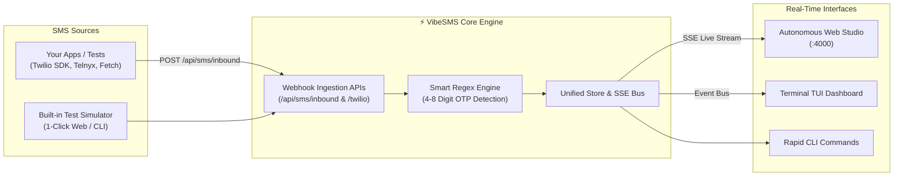

# ⚡ VibeSMS

> Autonomous Disposable SMS & Local OTP Verification Studio — Web Studio, Interactive Terminal TUI, and Twilio-Compatible Webhook Receiver.

[](https://nodejs.org)
[](docker-compose.yml)
[](LICENSE)
[](https://www.twilio.com)
[](https://www.npmjs.com)
[](https://arham.dev)
[](https://youtube.com/@walkcooklive)

---

## 💡 Overview

**VibeSMS** is a developer-first disposable SMS and OTP verification platform. Designed for engineers building authentication systems, automated test suites, and privacy workflows, VibeSMS lets you test SMS verification codes locally with **zero cost**, **zero real phone numbers**, and **zero external telecom dependencies**.

Pair it with [VibeMail](https://github.com/aeskafi/vibemail) for a complete autonomous authentication testing suite.



---

## ✨ Features

- 📱 **Virtual Phone Numbers**: Pre-configured virtual phone numbers for US, UK, Canada, France, and Germany.
- 🔑 **Smart OTP Extractor**: Automatically identifies 4-8 digit verification codes, Google `G-XXXXXX`, Discord, PINs, and OTPs with confidence scoring.
- 🎨 **Autonomous Web Studio (:4000)**:
  - **Dark / Light Theme** with persistent state.
  - **Real-Time Live Stream** via Server-Sent Events (SSE).
  - **Synthesizer Audio Chime** on incoming SMS delivery.
  - **1-Click Copy** for both phone numbers and detected OTP codes.
  - **Built-in Test Simulator** to trigger mock verification codes in one click.
- ⚡ **Interactive Terminal TUI**: Full-screen curses-style dashboard with live number switching (`[n]/[p]`), hotkey SMS simulation (`[s]`), and real-time updates.
- 🔄 **Twilio & Telnyx Webhook Compatible**: Drop-in receiver for Twilio form-encoded payloads returning compliant XML TwiML (`<Response></Response>`).
- 🐳 **Docker & Docker-Compose Ready**: 1-command deployment with volume persistence.
- 🛡️ **Zero Vulnerabilities**: 100% clean npm audit with native `node:test` suite.

---

## 🛠️ Step-by-Step Setup Guide

### Path A: Quick Local Development (Node.js)

**Prerequisites:** Node.js `>= 18.0.0` (check with `node -v`).

1. **Clone the repository:**
   ```bash
   git clone https://github.com/aeskafi/vibesms.git
   cd vibesms
   ```

2. **Install dependencies:**
   ```bash
   npm install
   ```

3. **Launch the services:**
   - **Launch Web Studio Dashboard:**
     ```bash
     npm start
     # or: node index.js web -p 4000
     ```
     Navigate to **`http://localhost:4000`** in your browser.

   - **Launch Full-Screen Terminal TUI:**
     ```bash
     npm run tui
     # or: node index.js tui
     ```

---

### Path B: Global CLI Installation

Link globally to use `vibesms` from any directory:

1. **Link globally:**
   ```bash
   git clone https://github.com/aeskafi/vibesms.git
   cd vibesms
   npm install
   npm link
   ```

2. **Verify global command:**
   ```bash
   vibesms --help
   ```

3. **Run CLI commands anywhere:**
   ```bash
   vibesms list                  # View virtual numbers
   vibesms simulate -c 123456    # Simulate test OTP code
   vibesms messages              # View recent inbound SMS messages
   vibesms web                   # Open Web Studio UI
   ```

---

### Path C: Docker & Docker Compose (Self-Hosted)

For 1-command containerized deployment:

1. **Start with Docker Compose:**
   ```bash
   git clone https://github.com/aeskafi/vibesms.git
   cd vibesms
   docker compose up -d
   ```

2. **Access Web Studio:**
   Open **`http://localhost:4000`** in your browser.

3. **Stop container:**
   ```bash
   docker compose down
   ```

---

### Path D: Linux Systemd Service (Production Daemon)

To keep VibeSMS running 24/7 as a background service:

1. Create service file:
   ```bash
   sudo nano /etc/systemd/system/vibesms.service
   ```

2. Paste configuration:
   ```ini
   [Unit]
   Description=VibeSMS Autonomous SMS & OTP Studio
   After=network.target

   [Service]
   Type=simple
   User=deck
   WorkingDirectory=/home/deck/Desktop/temp_repos/workspace_repos/vibesms
   ExecStart=/usr/bin/node index.js web --port 4000
   Restart=always
   RestartSec=5
   Environment=NODE_ENV=production PORT=4000

   [Install]
   WantedBy=multi-user.target
   ```

3. Enable and start:
   ```bash
   sudo systemctl daemon-reload
   sudo systemctl enable --now vibesms
   sudo systemctl status vibesms
   ```

---

## 🔌 Connecting Your Apps to VibeSMS Webhook (:4000)

Send SMS messages directly to VibeSMS from your backend code or automated tests:

### 1. Standard JSON POST (`fetch` / `axios`)
```javascript
await fetch("http://localhost:4000/api/sms/inbound", {
  method: "POST",
  headers: { "Content-Type": "application/json" },
  body: JSON.stringify({
    from: "AcmeAuth",
    to: "+12025550199",
    body: "Your verification code is 482019. Valid for 10 minutes."
  })
});
```

### 2. Twilio Client / Webhook Simulation
Point your Twilio webhook URL (or test harness) to:
```
http://localhost:4000/api/sms/twilio
```
Payload (form-encoded or JSON):
```bash
curl -X POST http://localhost:4000/api/sms/twilio \
  -d "From=+15551234" \
  -d "To=+12025550199" \
  -d "Body=Your Twilio passcode is 982104" \
  -d "MessageSid=SM12345"
```
Returns valid TwiML XML:
```xml
<Response></Response>
```

### 3. Python (`requests`)
```python
import requests

requests.post("http://localhost:4000/api/sms/inbound", json={
    "from": "SecurityService",
    "to": "+12025550199",
    "body": "G-592810 is your Google verification code."
})
```

---

## 💻 CLI & TUI Command Reference

| Command | Alias | Description |
|---|---|---|
| `vibesms web` | `vibesms ui` | Launches Web Studio dashboard on `localhost:4000` (custom `-p <port>`) |
| `vibesms tui` | `vibesms live`| Launches full-screen interactive Terminal Studio |
| `vibesms list` | `vibesms numbers` | Lists all available virtual phone numbers |
| `vibesms messages` | `vibesms inbox` | Displays recent inbound SMS messages and OTP codes |
| `vibesms simulate` | — | Simulates an incoming test SMS with optional `-c <code>` |

### Terminal TUI Keyboard Shortcuts
| Key | Action |
|---|---|
| `n` | Cycle to next virtual number |
| `p` | Cycle to previous virtual number |
| `s` | Simulate an incoming test OTP message |
| `q` or `Ctrl+C` | Clean exit from TUI |

---

## ⚙️ Environment Variables

| Variable | Default | Description |
|---|---|---|
| `PORT` | `4000` | Port for the Web Studio HTTP & SSE server |
| `HOST` | `0.0.0.0` | Bind host address |
| `NODE_ENV` | `development` | Runtime environment (`production` or `development`) |

---

## 🧪 Testing

Run the native test suite verifying OTP regex parsing, Twilio webhooks, and Web Studio APIs:

```bash
npm test
```

Expected output:
```console
✔ 1. OTP & Verification Code Extraction (4 tests pass)
✔ 2. Storage & Virtual Numbers Engine (2 tests pass)
✔ 3. Webhook Receiver Ingestion APIs (2 tests pass)
✔ 4. Web Studio HTTP & Real-Time Endpoints (3 tests pass)
✔ ⚡ VibeSMS Comprehensive Test Suite (11 tests pass, 0 fail)
```

---

## 👤 Author & Mission

Curated and maintained with passion by **Arham Eskafi** ([ارحام اسکافی](https://arham.dev)), Rapid MVP Specialist & Tech Nomad.
- 🌐 Website: [arham.dev](https://arham.dev)
- 🎥 Tech Nomad Overland Journey: [Walk Cook Live on YouTube](https://youtube.com/@walkcooklive)
- 🐙 GitHub: [@aeskafi](https://github.com/aeskafi)

---

## 📜 License

[MIT](LICENSE) © 2026 Arham Eskafi
